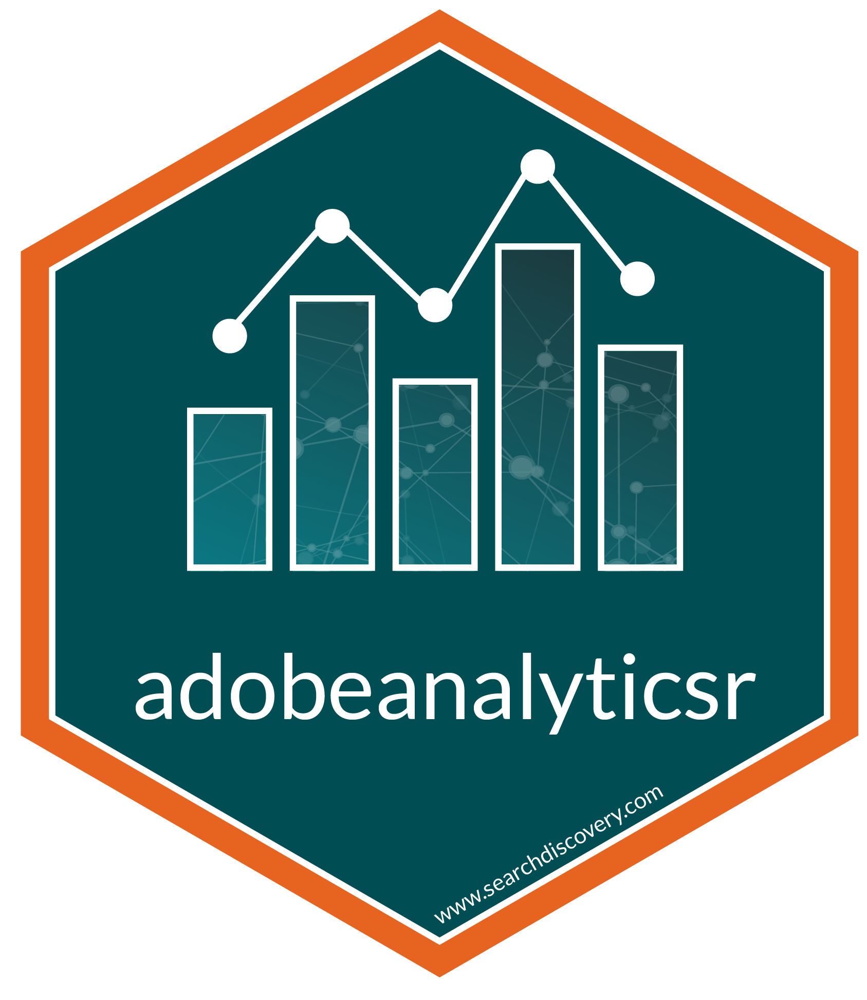
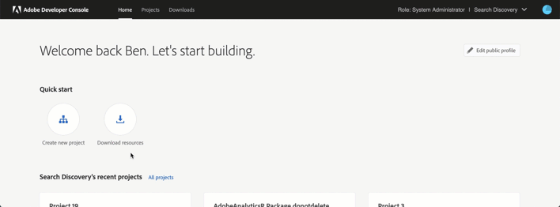

# adobeanalyticsr

## R Client for Adobe Analytics API 2.0

Connect to the Adobe Analytics API v2.0 which powers Analysis Workspace. The package was developed with the analyst in 
  mind will continue to be developed with the guiding principles of iterative, repeatable, timely analysis. New features
  are being actively being developed adn we value your feedback and contribution to the process.
  
### Current setup process overview

  1. Create the Adobe Console API Project 
  2. Create and add the OAuth arguments to your .Renviron file in your R project.
  3. Get your authorization token by using the function <code>aw_token()</code>.
  4. Get your company_id by using the function <code>get_me()</code>
  
#### Create the Adobe Console API Project 

  1. Navigate to the following URL: https://console.adobe.io/integrations.
  2. Click the "Create New Project" button.
  3. Click the "Add API" button.
  4. Select the Experience Cloud product icon and then choose "Adobe Analytics' and click "Next".
  5. Select the  OAuth option and then click "Next".
  6. Select "Web" as the platform where you want to the integration.
  7. Add Default redirect URI <code>https://adobeanalyticsr.com/token/result.html</code>
  8. Add Redirect URI pattern <code>https://adobeanalyticsr\.com/token/result\.html</code>
    
**Creating an Adobe Developer OAuth Project in under 60 seconds**

<video width="600" height="220" controls>
  <source src="man/figures/createoauthproject.mp4" type="video/mp4">
</video>

  
#### Set up the .Renviron file

This file is essential to keeping your information secure. It also speeds up analysis by limiting the number of arguments you need to add to every function call.
  
  1. Create a new file and save it with the name '.Renviron'.
  2. Get the following variables from the OAuth project and add them to the file. (see Creating an OAuth Client above)

      * `AW_CLIENT_ID` - OAuth client id found in the Adobe Developer Console
      * `AW_CLIENT_SECRET` - OAuth client secret key found in the Adobe Developer Console

  3. Add Company_id and Reportsuite_id (optional)

      * `AW_COMPANY_ID` - Using the function 'get_me()' you can see all the companies you have access to.
      * `AW_REPORTSUITE_ID` - Using the function "aw_get_reportsuites(company_id = '')" you can see all the report suite ids you can use within the chosen company.

After defining these 4 variables in the .Renviron file, restart your session.  After reloading
the adobeanalyticsr library, you should be able to run your first query using 'aw_get_metrics()'

